# JSP_BOARD

 

## 1.게시판 기능

 

#### 1.홈페이지 화면(index.jsp)

{: width="60%"}
 

- HOME 버튼을 누르면 Home page로 돌아오게 되고 USER를 클릭하게 되면 로그인 화면으로 전환된다.

 

#### 2.로그인 화면(login.jsp)

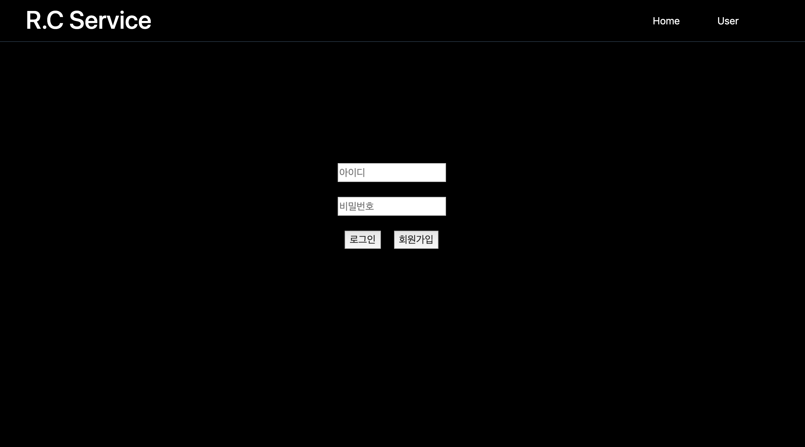{: width="60%"}
 

-회원가입을 누른뒤 회원가입 page로 넘어가 보자.

 

#### 3.회원가입 화면(register.jsp)
##### 3-1.아이디 중복확인

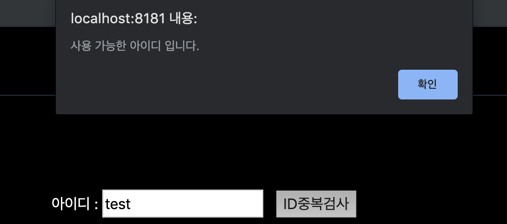{: width="60%"}
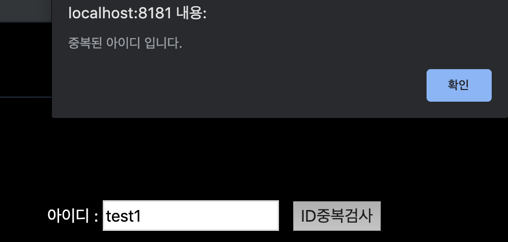{: width="60%"}

- 아이디가 중복되지 않으면 인증에 성공하며 중복될 경우 경고창으로 알려준다.

 

##### 3-2.닉네임 중복확인

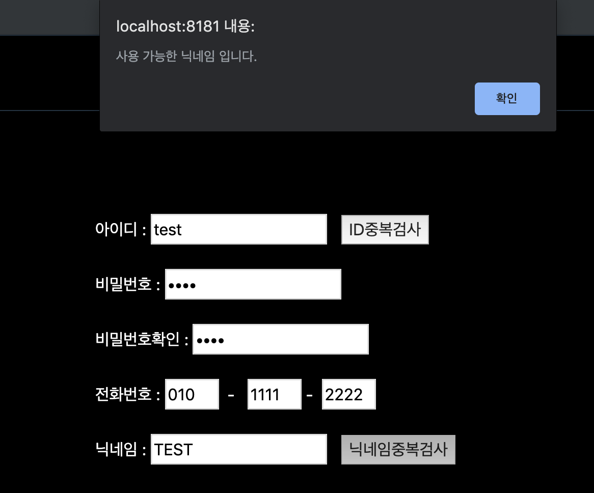{: width="60%"}

- 아이디와 마찬가지로 중복체크 기능이 있다.

 

##### 3-3.공란으로 회원가입시

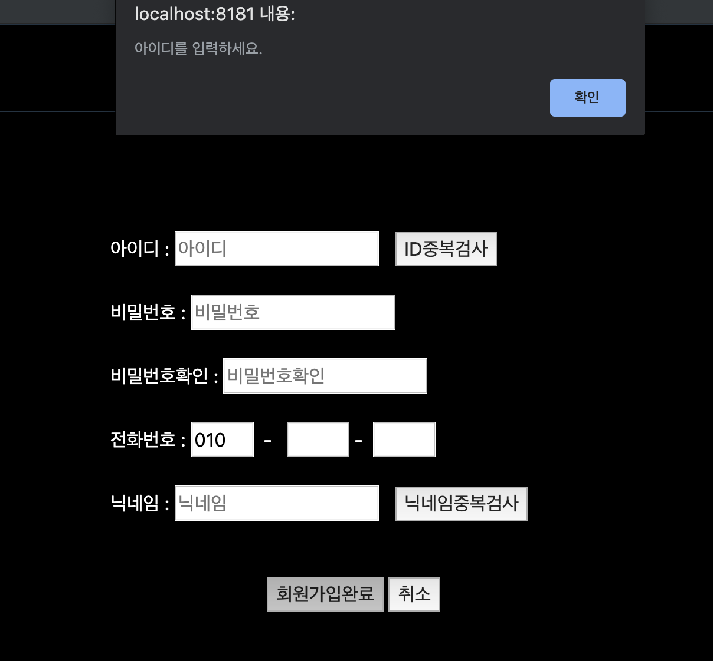{: width="60%"}
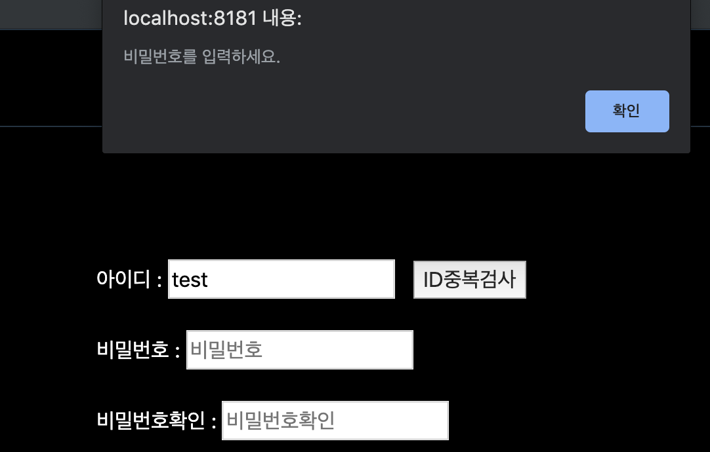{: width="60%"}

- 아무것도 입력하지 않고 회원가입을 누를 경우 각각의 경고창이 발생한다.

 

##### 3-4.회원가입 성공시

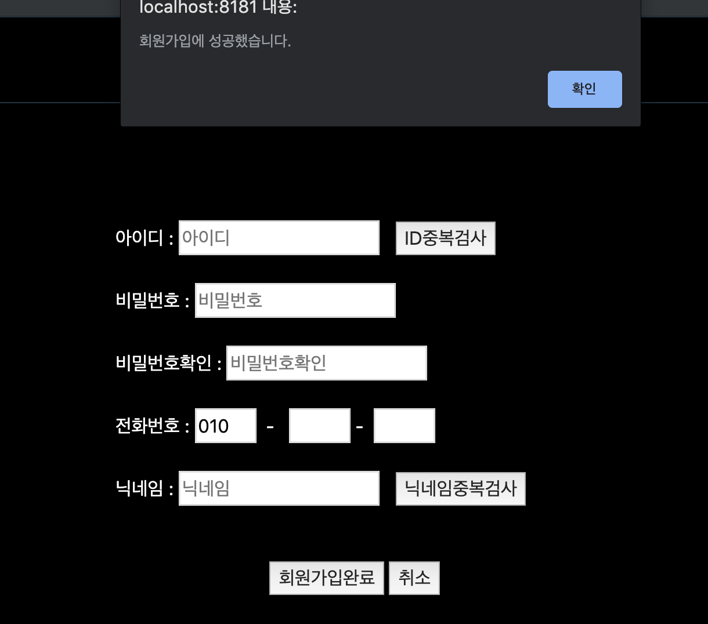{: width="60%"}

- 회원가입성공시 로그인 page로 넘어가게 되며, 실패시 회원가입 page에 머무른다.

 

##### 4.로그인실패와 성공

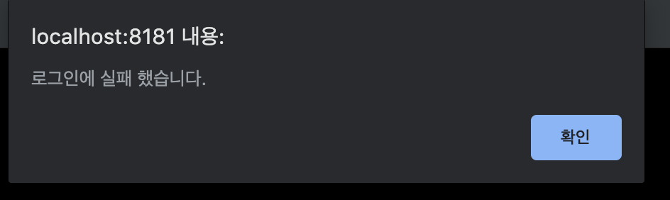{: width="60%"}

- 로그인 실패시 화면에 경고창이 나오며 다시 시도해야한다. 

 

{: width="60%"}

- 로그인성공시 home으로 돌아오며 logout버튼과 board버튼이 생성된다.

 

##### 5.게시판 

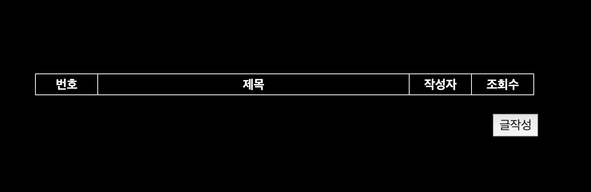{: width="60%"}

- 글작성을 누르게되면 글작성 페이지로 넘어간다.

 

##### 5-1.글작성

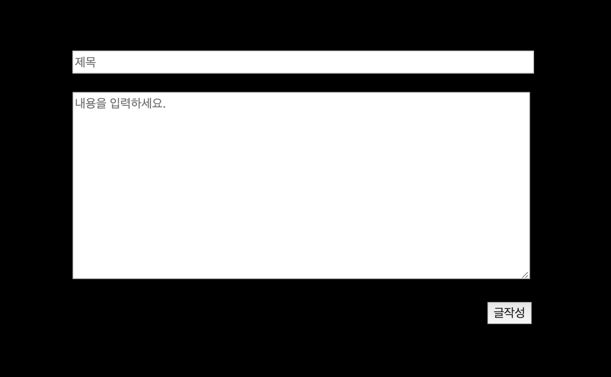{: width="60%"}
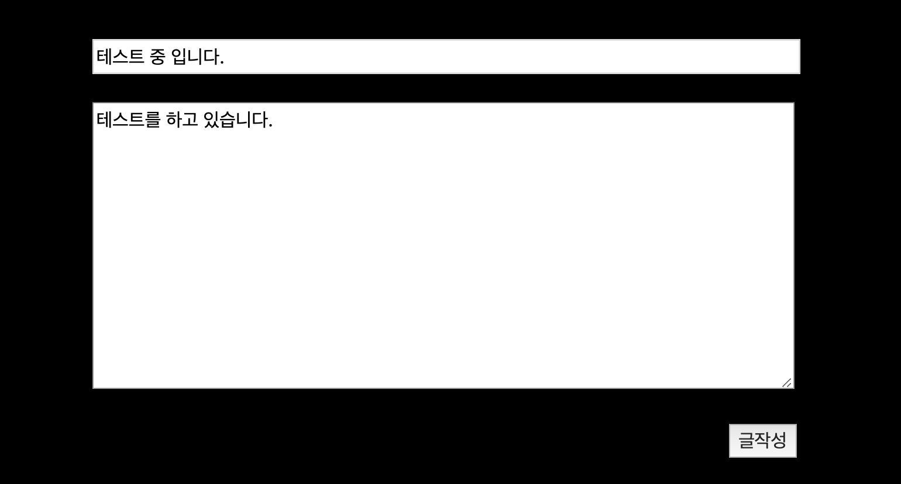{: width="60%"}
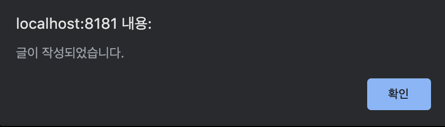{: width="60%"}
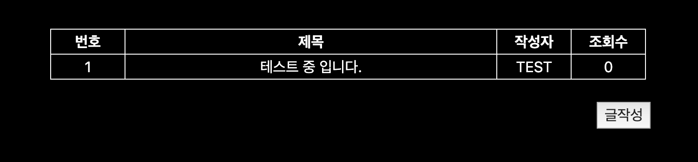{: width="60%"}

 

##### 5-2.조회수

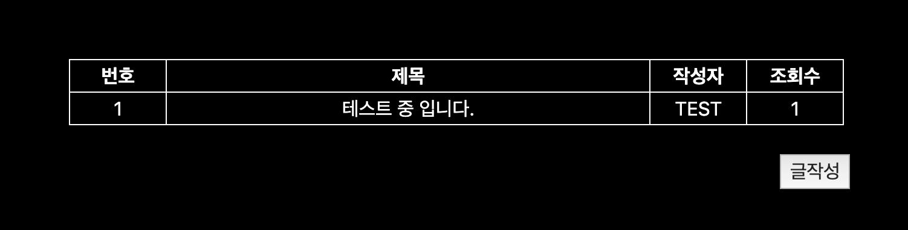{: width="60%"}

- 제목을 클릭하여 글을 볼 수 있으며, 조회수가 증가하게 된다.

 

##### 5-3.글 수정

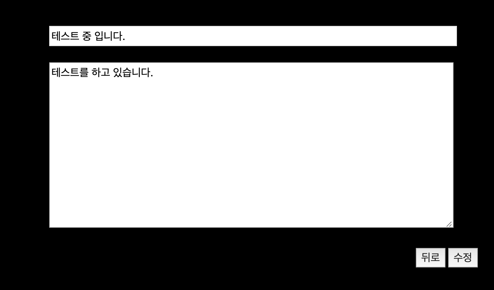{: width="60%"}
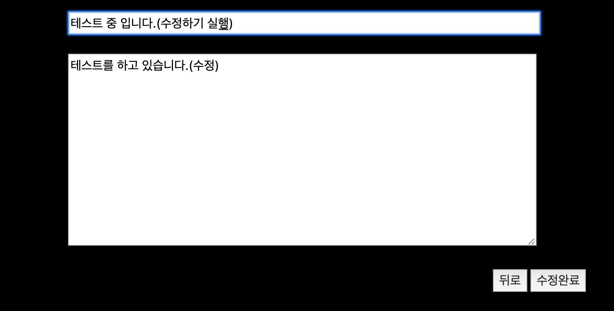{: width="60%"}
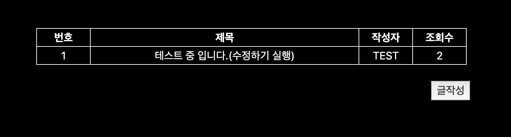{: width="60%"}

- 제목을 클릭하여 들어가게 되면 오른쪽 밑에 수정버튼이 생긴다.
- 수정버튼을 클릭하면 수정화면으로 넘어간다.
- 제목과 글을 수정한 후 수정완료를 클릭하면 수정이 완료된다.

 
